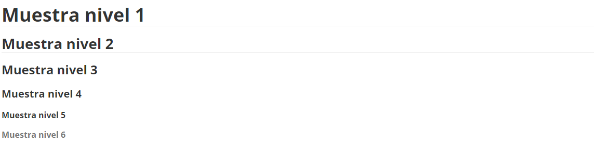
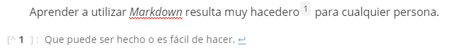
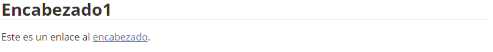
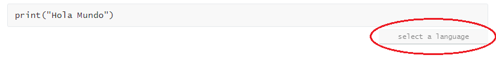
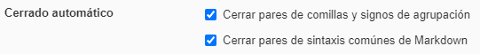
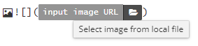

# Tutorial Markdown

[TOC]

## Introducción

*Markdown* es un lenguaje que permite escribir documentos de texto de manera sencilla e interactiva a través del teclado, sin necesidad de recurrir a ningún comando o herramienta en las distintas solapas del menú del programa con el que se lo utilice. El lenguaje no solo fue creado para ser sencillo de escribir, sino también para ser práctico de leer.

Existen distintos softwares que permiten utilizar el lenguaje. Este documento se centrará en las distintas herramientas de sintaxis de *Markdown* propiamente dicho y se mostrarán algunos aspectos de uno de los cientos de intérpretes del lenguaje, llamado *Typora*, el cual resulta bastante sencillo de usar y presenta una serie de herramientas muy útiles e interesantes.

Hoy en día, *Markdown* está presente en un alto número de lenguajes de programación, así como también en algunas plataformas y *frameworks*. Principalmente, se utiliza para escribir texto y luego transformarlo al formato HTML, exportando el archivo como tal. Esto resulta muy útil en el mundo de la documentación web, ya que permite generar el mismo contenido con menos caracteres y, por lo tanto, en menos tiempo. *Markdown* incluso permite escribir archivos en formato HTML si se lo desea. Gracias a las herramientas que trae la mayoría de editores, también se pueden exportar documentos en formato PDF, Word, RTF y varios otros.

Por todas las prestaciones del lenguaje previamente mencionadas, *Markdown* es muy recurrido en el mundo de la Web, particularmente en el desarrollo y publicación de blogs y artículos de todo tipo. No obstante, el espectro de posibilidades que ofrecen los editores de *Markdown* actuales hacen del lenguaje una herramienta fundamental para documentar cualquier proceso o proyecto de manera ágil y sencilla.

## Elementos de bloque

### Párrafos y saltos de línea

#### Párrafos

Para separar párrafos simplemente se debe omitir una línea, **pulsando dos veces la tecla de _Enter_ **. Si se dejan dos o más líneas en blanco, al procesarse el documento se convertirán en una sola.

#### Saltos de línea

Para realizar un salto de línea dentro de un mismo párrafo se debe **pulsar 2 veces la barra espaciadora** y luego pulsar ***Enter***.

### Encabezado

Para **crear** un encabezado se debe escribir una cierta cantidad de **\# (numeral/es)** al comienzo de la línea, un **espacio** y el **texto** que se desea introducir.

*Markdown* posee hasta **seis niveles de encabezados**, que varían en su tamaño y formato. A continuación se encuentra una lista con la forma de introducir cada uno de los distintos niveles de encabezados que *Markdown* admite:

| Nivel | Simbolización   |
| ----- | --------------- |
| 1     | \# (texto)      |
| 2     | \## (texto)     |
| 3     | \### (texto)    |
| 4     | \#### (texto)   |
| 5     | \##### (texto)  |
| 6     | \###### (texto) |

A continuación se encuentra un ejemplo de cada uno de los distintos estilos de encabezado, desde el nivel 1, el cual posee el mayor tamaño y funciona como título principal, hasta el 6, del menor tamaño y útil para dividir un tema por secciones:

### Citas

Una cita se realiza cuando queremos incluir palabras textuales de otro autor en nuestro documento. Sin embargo, cabe destacar que esta herramienta es muy útil para realizar avisos, aclaraciones, apartados o cualquier otra cosa que uno quiera separar del texto principal de manera vistosa y llamativa.

Las citas se generan utilizando el carácter **> (mayor que)** al comienzo de la línea, seguido de un **espacio** y el **texto** de la misma.

Si una cita está compuesta por **más de un párrafo** se debe introducir el **símbolo** al comienzo de **cada párrafo**, es decir, en la primer línea de los mismos, así como en **cada una de las líneas** que se dejan en **blanco** entre párrafos.

> ACLARACIÓN
>
> Por defecto, al presionar la tecla ***Enter*** una vez generada una cita, *Markdown* automáticamente genera otra línea dentro de la misma. Para salir de la cita y continuar escribiendo en un nuevo párrafo se debe presionar la tecla ***Enter* **una vez más.

A continuación se encuentra un ejemplo de una cita:

###### Código

~~~markdown
> Esto es una cita
> Esta es la segunda línea de la cita
>
> Este es otro párrafo de la cita
~~~

###### Visualización

> Esto es una cita
> Esta es la segunda línea de la cita
>
> Este es otro párrafo de la cita

#### Citas anidadas

Para **anidar citas**, es decir, introducir citas dentro de citas, simplemente se debe ingresar un signo de **> (mayor que) adicional** al comienzo de la línea en la que se desea introducir una cita anidada. El siguiente es un ejemplo de citas anidadas:

###### Código

~~~markdown
> Esto es una cita
>> Esta cita está anidada
~~~

###### Visualización

> Esto es una cita
>
> > Esta cita está anidada

### Listas

#### Listas desordenadas

Para **crear** una lista desordenada, es decir, una lista de elementos que no llevan ningún orden en particular es tan simple como introducir un **- (guion medio)** al comienzo de cada ítem, seguido de un **espacio** y el **texto** a visualizar. Alternativamente se acepta un **\* (asterisco)** o un **+ (signo más)**. Los tres signos se pueden alternar dentro de una misma lista sin alterar el resultado en pantalla.

A continuación se presenta un ejemplo de listas desordenadas:

###### Código

~~~markdown
- Ítem 1
+ Ítem 2
* Ítem 3
- Ítem 4
- Ítem 5
~~~

###### Visualización

- Ítem 1

+ Ítem 2

* Ítem 3

- Ítem 4

- Ítem 5

> ACLARACIÓN
>
> Por defecto, al presionar la tecla ***Enter*** una vez generada una lista, *Markdown* automáticamente genera otro ítem. Para salir de la lista y continuar escribiendo en un nuevo párrafo se debe presionar la tecla ***Enter***una vez más.

##### Listas anidadas

Al igual que con las citas, se pueden generar **listas anidadas** dentro de otras listas simplemente añadiendo **2 espacios en blanco** o **presionando la tecla *Tab*** antes de colocar el **- (guion medio)**, **\* (asterisco)** o **+ (signo más)**. Para **salir** de la lista anidada y seguir listando ítems basta con **presionar 2 veces la tecla *Enter*** luego de haber saltado a la próxima línea de la lista actual.

Se pueden generar cuantos niveles de listas anidadas se quiera, no existen restricciones en ese aspecto (siempre y cuando no se supere el largo del renglón.

A continuación se encuentra un ejemplo de listas anidadas:

###### Código

~~~markdown
- Ítem
	- Ítem anidado
- Ítem 2
	- Ítem 2 anidado
		- Ítem anidado al anidado
~~~

###### Visualización

- Ítem
  - Ítem anidado
- Ítem 2
  - Ítem 2 anidado
    - Ítem anidado al anidado

#### Listas ordenadas

Para generar una lista ordenada se debe seguir el formato ***"Número."***, es decir, un **número** seguido de un **punto**.

Al igual que las listas desordenadas, se pueden crear **listas anidadas**.

Además, se pueden **combinar ambos tipos** de lista sin problema. En otras palabras, se pueden anidar listas ordenadas con listas desordenadas y viceversa.

> ACLARACIÓN
>
> Por defecto, al presionar la tecla ***Enter*** una vez generada una lista, *Markdown* automáticamente genera otro ítem, siguiendo un orden de números naturales consecutivo ascendente. Para salir de la lista y continuar escribiendo en un nuevo párrafo se debe presionar la tecla ***Enter*** una vez más.

A continuación se encuentra un ejemplo de listas ordenadas y desordenadas combinadas:

###### Código

~~~markdown
- Lista 1
	1. Elemento 1
	2. Elemento 2
		- Elemento 2.1
		- Elemento 2.2
~~~

###### Visualización

- Lista 1
  1. Elemento 1
  2. Elemento 2
     - Elemento 2.1
     - Elemento 2.2

#### Listas de tareas

Para generar una lista de tareas se debe colocar un **- (guion medio)**, seguido de un espacio y un **[ ] (par de corchetes)**. Es importante aclarar que el par de corchetes debe contener un **espacio en medio**, de otra manera será interpretado como un par de corchetes textualmente. Sintácticamente es como generar una lista desordenada y agregarle el par de corchetes.

Para marcar una tarea que ya ha sido **realizada o completada**, se debe remover el espacio en medio de los corchetes y reemplazarlo por una **x (equis minúscula)**.

Las listas de tareas se pueden **anidar** con el resto de listas sin problema.

> ACLARACIÓN
>
> Por defecto, al presionar la tecla ***Enter*** una vez generada una lista, *Markdown* automáticamente genera otro ítem. Para salir de la lista y continuar escribiendo en un nuevo párrafo se debe presionar la tecla ***Enter*** una vez más.

A continuación se encuentra un ejemplo de listas de tareas:

###### Código

~~~markdown
- [ ] Tarea 1
- [ ] Tarea 2
- [x] Tarea 3
~~~

###### Visualización

- [ ] Tarea 1
- [ ] Tarea 2
- [x] Tarea 3

### Código

#### Bloques

Para introducir un bloque de código se deben ingresar **tres ~ (virgulillas, o coloquialmente "tildes de la eñe")** al comienzo de una línea y luego se debe copiar en la línea siguiente a la que finaliza el código que se quiere mostrar. 

Si se desea, se puede **agregar el lenguaje de programación** del cual se mostrará código a continuación (y sin espacios) del primer trío de virgulillas. De esta manera, el editor puede aplicar ciertas particularidades de su formato, por ejemplo, la diferenciación de colores entre objetos.

A continuación se encuentra un ejemplo de bloque de código:

###### Código

\~~~python

a = "Hola mundo"

print(a)

\~~~

###### Visualización

~~~python
a = "Hola mundo"
print(a)
~~~

#### Líneas

Existe un método para generar una línea de código, ingresando **cuatro espacios** al comienzo, pero se deben escribir los mismos al comienzo de cada línea. Por ello, este método no se suele utilizar, con salvedad de algunas situaciones en que sólo se quiere escribir una línea de código.

A continuación se encuentra un ejemplo de lo explicado: 

###### Código

~~~markdown
    Esto es una línea de código
Esto no lo es
    Esto también lo es
~~~

###### Visualización

    Esto es una línea de código

Esto no lo es

    Esto también lo es

#### Porciones

También se pueden introducir pequeñas **instrucciones o porciones de código** en medio de un párrafo o una línea, encerrando dicho código entre dos **`` (tildes reversos)**. Es importante aclarar que en este caso no se puede escoger el lenguaje, por lo que no se produce una diferenciación de formatos, si no una simple variación en la fuente del texto.

A continuación se encuentra una demostración:

| Código                                                       | Visualización                                                |
| ------------------------------------------------------------ | ------------------------------------------------------------ |
| \`print("Hola Mundo")\`                                      | `print("Hola Mundo")`                                        |
| Imprimir en pantalla \`print("Hola Mundo")\`                 | Imprimir en pantalla `print("Hola Mundo")`                   |
| Se utiliza la instrucción \`print()\` para imprimir por pantalla una cadena de caracteres | Se utiliza la instrucción `print()` para imprimir por pantalla una cadena de caracteres |

### Líneas horizontales

Se crean escribiendo **\*\*\* (tres asteriscos), --- ( tres guiones medios) o \_\_\_ (tres guiones bajos)** al comienzo de la línea y se utilizan normalmente para separar secciones de una manera visual.

A continuación se encuentra un ejemplo de línea horizontal:

###### Código

~~~markdown
Línea horizontal
---
~~~

###### Visualización

Línea horizontal

---

## Elementos de línea

### Énfasis

#### Itálica

Para darle formato de ***itálica*** a una letra, una palabra, una frase o incluso un párrafo entero si se lo desea, se debe encerrar el texto a remarcar entre **\* * (asteriscos)**. Alternativamente, se acepta **\_ \_ (guiones bajos)**. Dentro de un mismo texto se pueden remarcar tantas palabras, frases u oraciones  como se quiera, simplemente encerrando entre los signos previamente mencionados las partes a remarcar.

A continuación se encuentran algunos ejemplos de texto escrito en itálica:

| Código                                                  | Visualización          |
| ------------------------------------------------------- | ---------------------- |
| \*F\*útbol / \_F\_útbol                                 | *F*útbol               |
| \*Fútbol\* / \_Fútbol\_                                 | *Fútbol*               |
| \*Me gusta el fútbol\* / \_Me gusta el fútbol\_         | *Me gusta el fútbol*   |
| Me gusta \*el fútbol\* / Me gusta \_el fútbol\_         | Me gusta *el fútbol*   |
| Me \*gusta\* el \*fútbol\* / Me \_gusta\_ el \_fútbol\_ | Me *gusta* el *fútbol* |

#### Negrita

Para darle formato de **negrita** a una letra, una palabra, una frase o incluso un párrafo entero si se lo desea, se debe encerrar el texto a remarcar entre **\** \** (pares de asteriscos)**. Alternativamente, se aceptan **\__ \__ (pares de guiones bajos)**. Dentro de un mismo texto se pueden remarcar tantas palabras, frases u oraciones se quiera, simplemente encerrando entre los signos previamente mencionados las partes a remarcar.

A continuación se encuentran algunos ejemplos de texto escrito en negrita:

| Código                                                       | Visualización              |
| ------------------------------------------------------------ | -------------------------- |
| \*\*F\*\*útbol / \_\_F\_\_útbol                              | **F**útbol                 |
| \*\*Fútbol\*\* / \_\_Fútbol\_\_                              | **Fútbol**                 |
| \*\*Me gusta el fútbol\*\* / \_\_Me gusta el fútbol\_\_      | **Me gusta el fútbol**     |
| Me gusta \*\*el fútbol\*\* / Me gusta \_\_el fútbol\_\_      | Me gusta **el fútbol**     |
| Me \*\*gusta\*\* el \*\*fútbol\*\* / Me \_\_gusta\_\_ el \_\_fútbol\_\_ | Me **gusta** el **fútbol** |

#### *Itálica* y negrita

Para combinar la ***itálica*** y la **negrita** se debe encerrar el texto entre **\*\*\* \*\*\* (tríos de asteriscos)**. Alternativamente, se aceptan **\_\_\_ \_\_\_ (tríos de guiones bajos)**.

A continuación se encuentran algunos ejemplos de texto escrito en itálica y negrita combinadas:

| Código                                                       | Visualización                  |
| ------------------------------------------------------------ | ------------------------------ |
| \*\*\*F\*\*\*útbol / \_\_\_F\_\_\_útbol                      | ***F***útbol                   |
| \*\*\*Fútbol\*\*\* / \_\_\_Fútbol\_\_\_                      | ***Fútbol***                   |
| \*\*\*Me gusta el fútbol\*\*\* / \_\_\_Me gusta el fútbol\_\_\_ | ***Me gusta el fútbol***       |
| Me gusta \*\*\*el fútbol\*\*\* / Me gusta \_\_\_el fútbol\_\_\_ | Me gusta ***el fútbol***       |
| Me \*\*\*gusta\*\*\* el \*\*\*fútbol\*\*\* / Me \_\_\_gusta\_\_\_ el \_\_\_fútbol\_\_\_ | Me ***gusta*** el ***fútbol*** |

#### Tachado

Para darle formato de **~~tachado~~** a una letra, una palabra, una frase o incluso un párrafo entero si se lo desea, se debe encerrar el texto a remarcar entre **\~~ \~~ (pares de virgulillas)**. Dentro de un mismo texto se pueden remarcar tantas palabras, frases u oraciones se quiera, simplemente encerrando entre los signos previamente mencionados las partes a remarcar.

A continuación se encuentran algunos ejemplos de texto tachado:

| Código                         | Visualización              |
| ------------------------------ | -------------------------- |
| F\~~ú\~~tbol                   | F~~ú~~tbol                 |
| \~~Fútbol\~~                   | ~~Fútbol~~                 |
| \~~Me gusta el fútbol\~~       | ~~Me gusta el fútbol~~     |
| Me gusta \~~el fútbol\~~       | Me gusta ~~el fútbol~~     |
| Me \~~gusta\~~ el \~~fútbol\~~ | Me ~~gusta~~ el ~~fútbol~~ |

### Enlaces

#### Enlaces en línea

Los enlaces en línea son aquellos que se encuentran vinculados a una palabra, una frase o una oración, y que haciendo **click** llevan a un **sitio web**. Para generar un enlace de este tipo se debe encerrar el **texto** entre **[] (corchetes)** y a continuación (y sin espacios) la **URL** entre **(), paréntesis**.

A continuación se encuentra un ejemplo de enlace en línea:

###### Código

~~~markdown
Este [link](https://google.com) dirige a la página principal de Google.
~~~
###### Visualización

Este [link](https://google.com) dirige a la página principal de Google.

#### Enlaces como referencia

Estos enlaces funcionan como los anteriores, pero con la diferencia que en lugar de ingresar el link o URL del sitio al que se desea vincular el texto, se ingresa una **referencia** entre **[] (corchetes)** a continuación (y sin espacios) del par de corchetes que contiene al texto vinculado. Una vez exportado el documento, las referencias se vuelven **invisibles**, es decir que solo el autor puede observarlas en el código.

Estas referencias se deben **definir** en algún lugar del documento, lo normal es dejar una sección aparte para referencias o al final de la sección correspondiente. Para definir una referencia se debe encerrar un **texto** entre **[] (corchetes)** y a continuación (y sin espacios) colocar **: (dos puntos)**, un **espacio** y la **URL** correspondiente. 

**Opcionalmente,** se puede **agregar un título** a cada referencia, que sólo se visualiza en la definición de la misma y sirve como ayuda visual. Esto se hace ingresando un **espacio** a continuación de la **URL** y el título entre **"" (comillas)**. 

A continuación se encuentra un ejemplo de enlaces como referencia:

###### Código

~~~markdown
Este [link][google] dirige a la página principal de Google, mientras que [este][bio] dirige a la página de Wikipedia que habla sobre el mismo.

[google]: https://google.com
[bio]: https://es.wikipedia.org/wiki/Google "Biografía de Google"
~~~

###### Visualización

Este [link][google] dirige a la página principal de Google, mientras que [este][bio] dirige a la página de Wikipedia que habla sobre el mismo.

[google]: https://google.com
[bio]: https://es.wikipedia.org/wiki/Google	"Biografía de Google"

#### Enlaces automáticos

Estos enlaces se utilizan cuando lo que se quiere mostrar es directamente la dirección del sitio web. Para generarlos, lo único que se debe hacer es encerrar la **URL** entre los símbolos **< > (menor que y mayor que)**.

A continuación se encuentra un ejemplo de enlace automático:

###### Código

~~~markdown
Puedes ver los videos que desees en <https://www.youtube.com/>, una plataforma de multimedia de primer nivel.
~~~

###### Visualización

Puedes ver los videos que desees en <https://www.youtube.com/>, una plataforma de multimedia de primer nivel.

### Imágenes

Insertar una imagen en *Markdown* es muy similar a crear un enlace, con la diferencia que se debe ingresar un **! (signo de exclamación de cierre)** al comienzo. En este caso, el **[] (par de corchetes)** encierra un **texto alternativo** que se utiliza como modo de identificación de lo que representa la imagen si la carga de esta fallara por alguna razón. Como lo dice su nombre es **opcional**, es decir que puede estar vacío, pero los corchetes deben incluirse sí o sí. Finalmente, entre **(), paréntesis,** se debe colocar el **nombre** con el que está grabada la imagen (incluyendo la extensión del archivo) si es que se encuentra en la **misma carpeta** que el archivo de *Markdown* que se está editando, o la **ubicación completa** de la imagen si no lo está.

**Opcionalmente,** se puede incluir un **título alternativo** que aparece al dejar el puntero del ratón sobre la imagen, y se ingresa entre **"" (comillas)**, con un **espacio** previo a su ingreso, a continuación del nombre o ubicación de la imagen, **dentro del paréntesis**.

También, de la misma manera que con los [enlaces](#Enlaces), se pueden crear **referencias** a imágenes en otro lugar del documento para utilizarlas en lugar del nombre o ubicación de la imagen, ingresando la **URL** de la misma en lugar de su nombre o ubicación. Estas referencias también se tornan **invisibles** para el lector.

A continuación se encuentra una serie de ejemplos de inserción de imágenes:

###### Código

~~~markdown

*Este es el logo de Markdown*

![Logo Typora][logo_ty]
*Este es el logo de Typora*

[logo_ty]: https://d33wubrfki0l68.cloudfront.net/afe968cf5a0924ca11a2d20fda0694743bf2d13b/80364/assets/images/tool-icons/typora.png
~~~

###### Visualización

*Este es el logo de Markdown*

![Logo_Typora][logo_ty]
*Este es el logo de Typora*

[logo_ty]: https://d33wubrfki0l68.cloudfront.net/afe968cf5a0924ca11a2d20fda0694743bf2d13b/80364/assets/images/tool-icons/typora.png	"Logo de Typora"

## *Multimarkdown*

*Multimarkdown*, nació de la necesidad de escribir documentos académicos utilizando *Markdown*. Así que este lenguaje no solo incluye todas las herramientas mencionadas anteriormente, sino que añade la capacidad de escribir notas al pie de página, tablas, y otras más.

A pesar que no todos los editores incluyen las herramientas de *Multimarkdown*, *Typora* es uno de los que sí lo hacen, pero no en su totalidad. Por ello, a continuación se detallarán sólo aquellas herramientas de *Multimarkdown* que están contempladas en *Typora*: las **tablas**, las **notas al pie de página** y las **referencias cruzadas**.

### Tablas

Para crear una tabla primero se deben definir sus encabezados y luego se deben generar el resto de filas.

Para definir los encabezados, lo que se debe hacer es escribir cada uno separado por **| (barras verticales)**. El **ancho** de cada **columna** se define según **cantidad de caracteres** que haya en la fila más larga de cada columna. Para especificar que esta línea corresponde a los encabezados de la tabla, se debe crear una línea debajo con la misma cantidad de secciones separadas por **| (barras verticales)**, pero con **-- (dos guiones medios)** en cada una de estas.

Una vez definidos los encabezados, se pueden comenzar a **crear** las siguientes **filas** de la tabla con la **misma sintaxis** que se utilizó para generar los encabezados. *Markdown* logra diferenciarlas gracias a la segunda línea compuesta por guiones medios, por lo que es muy importante que esta no se omita.

Se pueden **agregar columnas** cuando se lo desee, pero para ello se debe agregar el encabezado correspondiente y modificar cada una de las filas, por lo que se recomienda definir con exactitud la cantidad de columnas a la hora de crear la lista.

A continuación se encuentra un ejemplo de tabla:

###### Código

~~~markdown
| Primera columna | Segunda columna | Tercera columna |
| -- | -- | -- |
| Contenido 1-1 | Contenido 1-2 | Contenido 1-3 |
| Contenido 2-1 | Contenido 2-2 | Contenido 2-3 |
| Contenido 3-1 | Contenido 3-2 | Contenido 3-3 |
~~~

###### Visualización

| Primera columna | Segunda columna | Tercera columna |
| --------------- | --------------- | --------------- |
| Contenido 1-1   | Contenido 1-2   | Contenido 1-3   |
| Contenido 2-1   | Contenido 2-2   | Contenido 2-3   |
| Contenido 3-1   | Contenido 3-2   | Contenido 3-3   |

### Notas al pie de página

Las notas al pie de página suelen ser muy útiles en documentos o *blogs*, ya que se utilizan para dar definiciones de ciertas palabras o conceptos al final del documento, a modo de no incluirlas en el texto principal para que no resulte muy engorroso o pesado de leer.

Para **crear** una nota al pie de página se debe escribir el **texto** o **número** que se utiliza como referencia entre **[] (corchetes)** con un **^ (tilde circunflejo)** al **comienzo** del texto dentro de los **corchetes**.

Para **definir** la nota al pie de página se debe escribir el mismo **texto** encerrado entre **[] (corchetes)**, con un **^ (tilde circunflejo)** al comienzo, en alguna parte del documento, seguido de **: (dos puntos)**, un **espacio** y el **texto** que corresponde a la definición o aclaración del concepto que se desea referenciar.

Al **colocar el puntero** del ratón sobre la nota, se puede observar la referencia y al **clickear** en ella nos lleva automáticamente a la parte del documento donde se encuentra la referencia y **viceversa**.

A continuación se encuentra un ejemplo de notas al pie de página:

###### Código

~~~markdown
Aprender a utilizar *Markdown* resulta muy hacedero[^1] para cualquier persona.

[^1]: Que puede ser hecho o es fácil de hacer
~~~

###### Visualización

### Referencias cruzadas

Este apartado se refiere a aquellos enlaces que permiten vincular una sección dentro del **propio documento**, a través de **referencias **a sus **encabezados**.

Para **crear el enlace**, se sigue el mismo formato que con el [enlace en línea](#Enlaces en línea), con la diferencia que el texto entre **(), paréntesis,** debe ser la referencia, es decir, el texto literal del encabezado al que se desea vincular, incluyendo un **# (numeral)** al comienzo dentro de los paréntesis.

A continuación se encuentra un ejemplo de enlaces internos:

###### Código

~~~markdown
## Encabezado1

Este es un enlace al [encabezado](#Encabezado1).
~~~

###### Visualización

## Omitir *Markdown*

Una pregunta que ya te habrás hecho es **cómo hago para escribir los símbolos de la sintaxis de *Markdown*** sin que sean tomados como tales, sin contar por supuesto los bloques de código, que omiten estas particularidades. Para que *Markdown* ignore un signo de su sintaxis lo que se debe hacer es ingresar una **\ (contrabarra o barra invertido)** delante. Si se desea **omitir la propia contrabarra**, se debe ingresar otra delante de la misma.

A continuación se muestran algunos ejemplos:

| Código                                                | Visualización                                       |
| :---------------------------------------------------- | --------------------------------------------------- |
| \\\*Fútbol* debería estar en cursiva                  | \*Fútbol* debería estar en cursiva                  |
| \\- Este debería ser un ítem de lista, omite la lista | \- Este debería ser un ítem de lista                |
| \\## Este debería ser un encabezado de segundo nivel  | \## Este debería ser un encabezado de segundo nivel |

## *Typora*

*Typora* es **uno de los editores de *Markdown* más utilizados**, ya que genera una simpleza y una docilidad a la hora de escribir mayor a la del propio lenguaje, a través de una serie de herramientas y atajos. Además, es totalmente **gratuito**.

A continuación se detallarán varias de estas **herramientas y funcionalidades**, aunque solo me concentraré en aquellas que considero más útiles y de uso frecuente, por lo que deberás investigar en su [sitio web oficial](https://typora.io/) si te interesa obtener más información acerca de los usos del programa.

### Exportar archivos de *Markdown*

Al igual que la mayoría de los editores de *Markdown*, *Typora* permite exportar archivos de formato **.md** (extensión de los archivos de *Markdown*) como archivos de otros formatos, entre ellos **HTML, PDF y Word**. Para ello se deben realizar los siguientes pasos:

1. Ingresar al menú de **Exportar** en la solapa de **Archivo (F)** que se encuentra en la parte superior derecha de la ventana del programa.
2. Seleccionar el **formato** al que se desee exportar el archivo.

### Tabla de contenidos

La tabla de contenidos permite agrupar todos los distintos encabezados que contiene el documento, en una sola sección, que normalmente corresponde al comienzo del mismo. Además, si en el menú de **Visualización** (ubicado arriba a la derecha del documento) activamos la opción de **Índice**, esta nos permite observarlo en una barra lateral en todo momento, situada a la izquierda del documento.

Cada uno de los encabezados de la tabla de contenidos posee un **enlace** que, al darle click, lleva a la sección del documento donde se encuentra el mismo, y todo su contenido. Por lo tanto, te recomiendo incluirlo siempre, ya que resulta muy útil y práctico para el lector y para ti mismo a la hora de editar.

Para generar una tabla de contenidos simplemente deberás escribir el comando **[TOC]** y pulsar la tecla ***Enter***. El programa va incluyendo los distintos encabezados en ella de manera automática a medida que los escribas, por lo que no deberás preocuparte por incluirlos tú mismo.

> ACLARACIÓN
>
> Aunque no se cree la **Tabla de Contenidos**, *Typora* igualmente generará un **Índice** con todos los encabezados del documento, pero este no será visible ni aprovechable por el lector luego de exportar el archivo, ya que solo permanecerá visible en la edición del documento.

### Archivos

En la barra lateral previamente mencionada, además podemos visualizar otras cosas como el árbol de **Archivos** de extensión **.md** que se encuentran en la ubicación o carpeta donde guardamos el documento con el que estamos trabajando actualmente.

*Typora* permite tener activas tanto la barra de **Índice** y **Archivos** al mismo tiempo, pudiendo alternar entre ellas haciendo click en sus encabezados.

### Bloques de ecuaciones

Los bloques de ecuaciones permiten escribir todo tipo de ecuación matemática, incluyendo operaciones o símbolos matemáticos que se introducen a través de ciertos códigos, que siguen el formato "**\\código**", es decir, una **\\ (contrabarra o barra invertida)** seguida de una **palabra** acorde a la operación o símbolo que se desea introducir. La sintaxis de los bloques de ecuaciones se basa en un lenguaje llamado *LaTeX*, en el cual no me adentraré, pero dejaré el [link](http://tug.ctan.org/info/short-math-guide/short-math-guide.pdf) a un documento que la detalla por completo para aquellos que les interese.

Para **crear** un bloque de ecuaciones se deben ingresar **$$ (dos signos de dólar)** al comienzo de la línea y cerrar con otro par de signos de dólar en la última línea del bloque. De esta manera, el **texto** que se encuentre **entre los dos pares de signos** se transformará en una **ecuación**.

Si se desean escribir **varias líneas** de ecuaciones se deben ingresar **\\\\ (dos contrabarras o barras invertidas)** al **final de cada línea**, de otra manera todo el código escrito se va a mostrar en la misma línea.

A continuación se encuentra un ejemplo de bloque de ecuaciones:

###### Código

~~~latex
$$
p(x) = x ^ 2 + 2x + 1\\
p(x) = (x + 1) ^ 2
$$
~~~

###### Visualización

$$
p(x) = x ^ 2 + 2x + 1\\
p(x) = (x + 1) ^ 2
$$

> ACLARACIÓN
>
> En la vista normal de *Typora* basta con ingresar la primer línea de $$ (signos de dólar) para que se genere el bloque de ecuaciones.

### Alternar vistas

*Typora* permite alternar entre la vista del **código fuente**, es decir el **input**, y la vista **normal** donde se observa el resultado, o **output**. En la primer ventana, se escribe utilizando todos los métodos mencionados en este documento acerca de la sintaxis de *Markdown*. En cambio, en la segunda podemos utilizar las **herramientas y funcionalidades** de *Typora* que nos permiten escribir de manera más dócil y cómoda, así como observar el resultado en pantalla a medida que escribimos el código, ya que el programa lo interpreta en tiempo real.

Para alternar entre estas dos vistas se debe hacer click en el botón que se encuentra abajo a la izquierda, simbolizado como "**</>**", o bien ir a la solapa de **Visualización** y seleccionar la opción **Modo código fuente**.

> ACLARACIÓN
>
> Todas las funcionalidades que se detallan a continuación se pueden aprovechar desde la vista normal, y no desde la vista de código fuente.

### Generación de párrafos y saltos de línea

En *Typora* los [párrafos](#Párrafos) se generan de manera automática al presionar la tecla ***Enter*** una sola vez. Asimismo, no debemos preocuparnos por dejar dos espacios al final de cada línea para que se produzca un [salto de línea](#Saltos de línea), ya que el editor los **agrega automáticamente** al pasar a la **línea siguiente**, es decir, cuando el texto de la actual ocupa todo el ancho de la página.

### Generación de bloques de código

*Typora* permite crear [bloques de código](#Bloques) de una manera más simple y ágil simplemente ingresando el **~~~ (trío de virgulillas)** de apertura y presionando la tecla ***Enter***, sin necesidad de cerrar el bloque con otro trío de virgulillas.

Además, para **escoger el lenguaje** del bloque se puede realizar de dos maneras: la clásica, colocando el nombre del mismo luego del primer "**~~~**"; o creando el bloque sin seleccionar ninguno y luego escribirlo en un espacio abajo a la derecha del bloque que *Typora* reserva para la selección del lenguaje. A continuación se muestra el segundo método:

- En esta imagen se muestra el espacio reservado para seleccionar el lenguaje.

- En esta imagen se observa como, al seleccionar el lenguaje, es inmediatamente interpretado y se aplica un formato determinado al contenido del bloque de código.

.png)

>  ACLARACIÓN
>
> Para salir del bloque de código y continuar desarrollando el texto principal del documento se deben presionar las teclas ***Ctrl + Enter***, ya que al presionar solo ***Enter*** se crea una nueva línea de código dentro del bloque.

### Generación de tablas

En *Typora*, para generar una **tabla**, basta con formular la línea de encabezados, siguiendo las instrucciones especificadas en la sección de [tablas](#Tablas), y presionando la tecla ***Enter***. De esta manera, la tabla se creará automáticamente. 

Para **agregar filas** es tan simple como presionar las teclas ***Ctrl + Enter***, ya que al presionar solo ***Enter*** se saldrá de la tabla y continuará en la próxima línea del texto principal del documento.

En conclusión, en *Typora* los bloques de código y las tablas trabajan de manera inversa.

### Marcar tarea como completada

En *Typora* no hace falta modificar el código de un ítem en una [lista de tareas](#Listas de tareas) para marcarla como completada, ya que el programa permite hacerlo con tan solo darle **click** al **espacio en blanco** de la tarea correspondiente.

### Insertar elementos con click derecho

Cómo si fuera baja la velocidad de escritura con *Markdown*, *Typora* nos permite tener aún más insertando imágenes, tablas, bloques de código y otros elementos, simplemente siguiendo los siguientes pasos:

1. Presionar el **click derecho** del ratón sobre el espacio del documento donde deseamos insertar dicho elemento.
2.  Seleccionar la opción de **Insertar**, que despliega una lista con todos los elementos, donde debemos escoger uno.

Además, al abrir el menú presionando click derecho, aparecen otras herramientas útiles como las de [énfasis](#Énfasis), que agilizan mucho el desarrollo del documento.

### Anidar listas y citas

En *Typora* podemos anidar [listas](#Listas) o [citas](#Citas) simplemente presionando la tecla ***Tab***, luego de haber pasado a la siguiente línea o ítem, con el contenido del mismo aún **vacío**.

### Aplicar énfasis a un texto escrito

Para dar énfasis (cursiva, negrita o tachado) a un texto que ya se ha escrito, *Typora* nos ahorra el tener que incluir los signos correspondientes antes y después de la porción de texto que se desea remarcar, ya que nos permite **seleccionarla con el puntero del ratón y presionar la tecla correspondiente**. 

Normalmente, esto haría que se reemplace todo el texto seleccionado, por el signo asociado a la tecla presionada, pero *Typora* está programado para que eso no suceda al utilizar los símbolos que corresponden a la sintaxis de *Markdown*.

### Pares de símbolos automáticos

*Typora* puede configurarse de tal forma que al ingresar un símbolo de la sintaxis de *Markdown*, como el **\* (asterisco)**, o un signo de uso común que requiere apertura y cierre, como las **"" (comillas)**, automáticamente se genere el símbolo de cierre, de manera que el usuario no tenga que andar preocupándose por cerrar paréntesis, corchetes y demás, y simplemente se concentre en escribir el texto que va dentro.

Para **activar** esta funcionalidad se debe:

1. Ingresar al menú de **Preferencias...** en la solapa de **Archivo (F)** que se encuentra en la parte superior derecha de la ventana del programa.
2. Seleccionar la sección denotada con la etiqueta **Editor**.
3. Marcar ambas opciones en la sección de **Cerrado automático**, haciendo click en el espacio vacío que se encuentra a la izquierda de cada una de ellas.

### Elegir imagen desde el explorador de archivos

En *Typora* podemos ingresar la ubicación de la imagen que queremos insertar sin necesidad de escribirla o copiarla del explorador de archivos manualmente. Esto se hace introduciendo el formato indicado en la sección de [imágenes](#Imágenes), pero vacío, es decir, escribir solamente los símbolos que se indican sin incluir ningún texto, y presionando el botón que se encuentra a la derecha de la leyenda **input image URL**, dentro de los paréntesis.

La siguiente imagen muestra el botón que se debe presionar para insertar la ubicación de la imagen:

### Gráficos y diagramas

En *Typora* podemos crear infinidades de **gráficos y diagramas**, como un Diagrama de GANTT o un Diagrama de Flujo, a través de una herramienta externa que se llama ***mermaid***. Para utilizarla, debemos seleccionarla como **lenguaje** en un **bloque de código** y operar dentro de él con la sintaxis del lenguaje. En este documento no me adentraré en las posibilidades que ofrece *mermaid*, porque son infinitas y no son relevantes a la sintaxis de *Markdown*, si no que es un *plugin* que incluyen algunos editores como *Typora*. Por ello, dejo el [link](https://mermaid-js.github.io/mermaid/#/) al sitio oficial de *mermaid* en caso que desees indagar en él.

A continuación se encuentra un ejemplo de un Diagrama de GANTT realizado con *mermaid*:

~~~mermaid
gantt
dateFormat YYYY-MM-DD
title Plan de Trabajo

section Sistema de Programación de Clases
Plan de trabajo									:crit, done, plan, 2020-10-21, 1w
Lectura de doc. inicial							:crit, done, lec, 2020-10-21, 2w
Análisis de errores del software y del manual	:		 after lec, 8w
1° entrega										:done, ent1, after lec, 1w
2° entrega										:active, ent2, after ent1, 1w
3° entrega										:		 ent3, after ent2, 1w
4° entrega										:		 ent4, after ent3, 1w
5° entrega										:		 ent5, after ent4, 1w
6° entrega										:		 ent6, after ent5, 1w
7° entrega										:		 ent7, after ent6, 1w
8° entrega										:		 ent8, after ent7, 1w

section Capacitación Markdown
Familiarización con el lenguaje					:crit, active, fam, 2020-10-14, 4w
Tutorial documentado							:crit,	 tut, after fam, 3w
Videotutorial									:		 vdt, after tut, 2020-12-15
Capacitación									:		 cap, after tut, 2020-12-15

~~~

## Bibliografía

- markdown.es, *Qué es Markdown*, Enlace: https://markdown.es/, Publicado en: 31/5/2017, Consultado en: 27/11/2020.

- markdown.es, *Sintaxis Markdown*, Enlace: https://markdown.es/sintaxis-markdown/, Publicado en: 31/5/2017, Consultado en: 27/11/2020.

- markdown.es, *Multimarkdown*, Enlace: https://markdown.es/multimarkdown/, Publicado en: 31/5/2017, Consultado en: 27/11/2020.